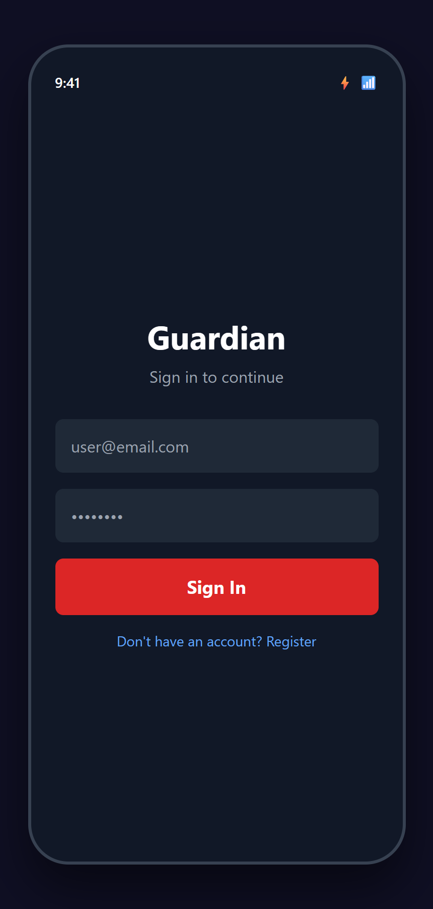
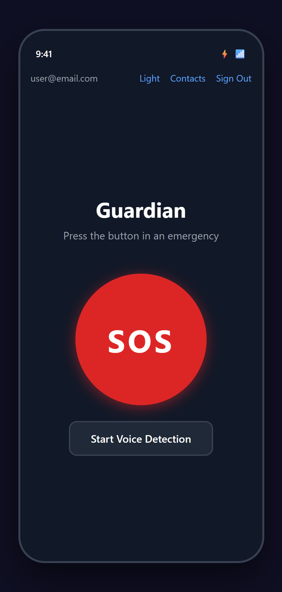
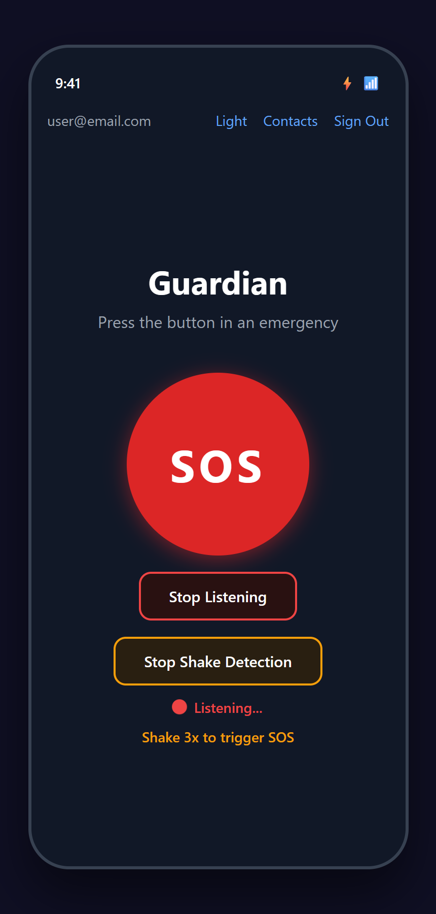
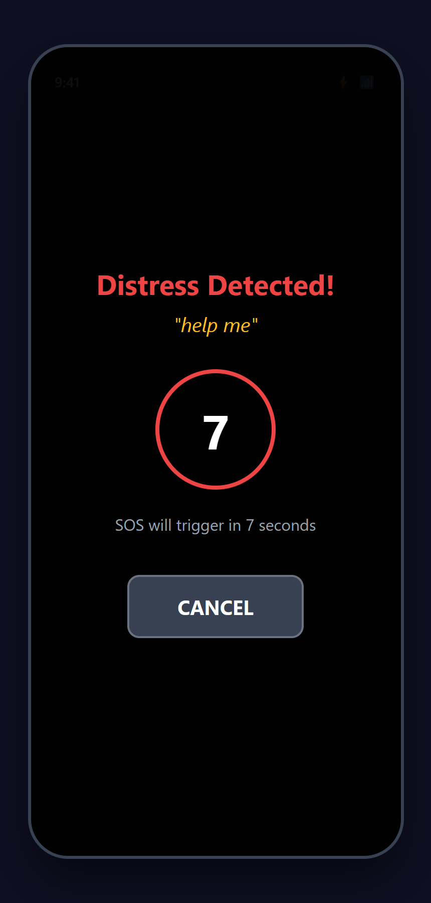
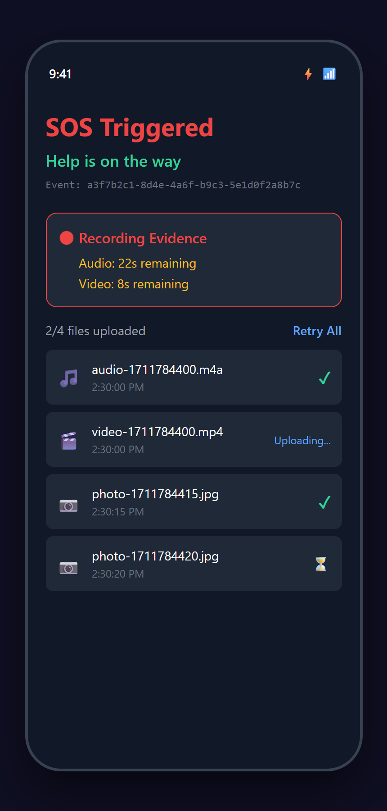
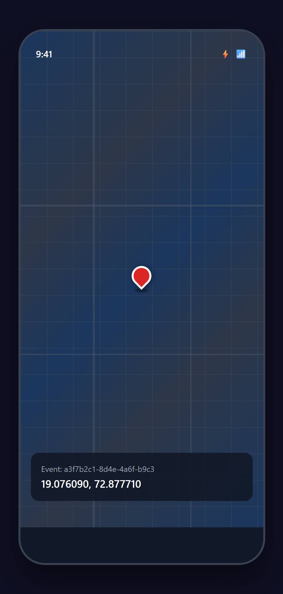
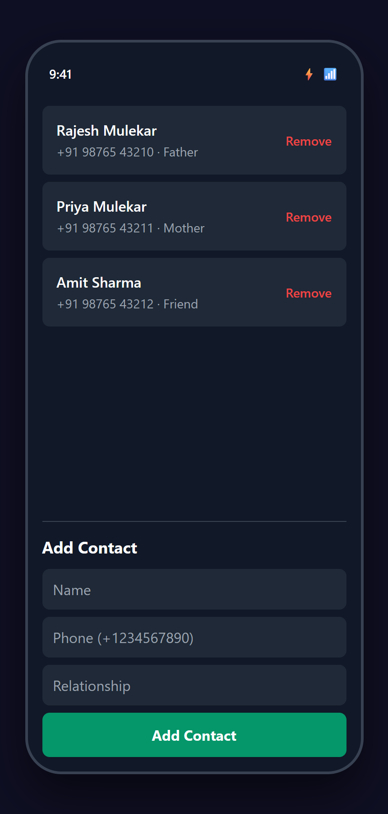
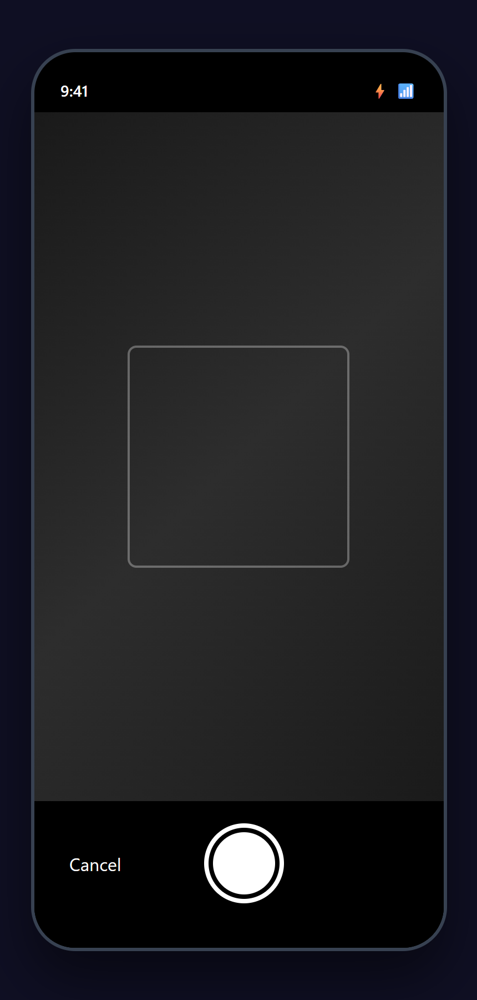
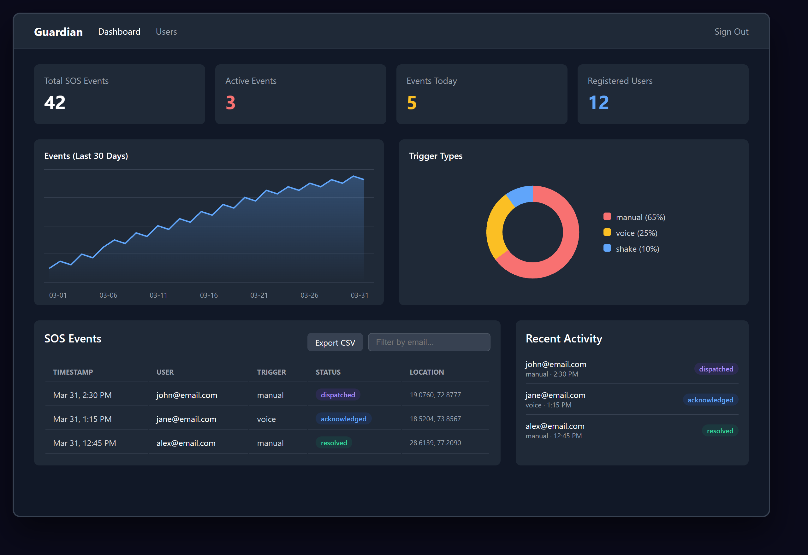
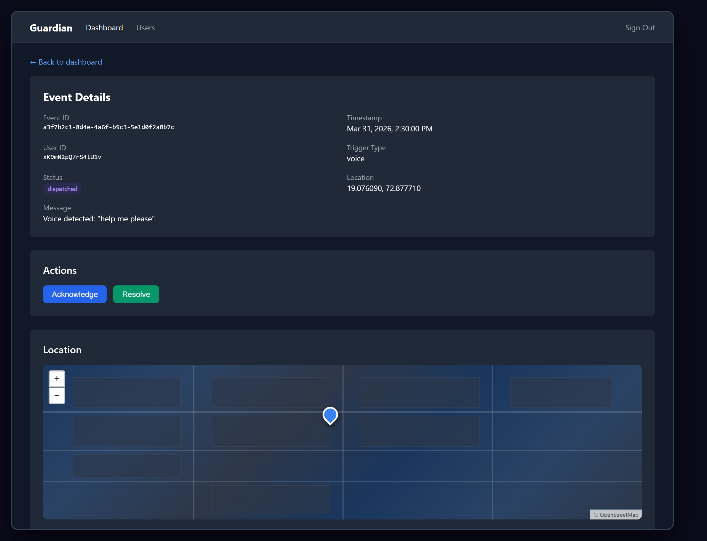

# Project Guardian

### AI-Powered Smart Mobile Safety System

<p align="center">
  
</p>

<p align="center">
  <strong>Guardian</strong> is an AI-powered mobile safety application that enables one-tap SOS alerts, voice-activated emergency triggering, shake-based distress detection, automatic evidence recording, and real-time location tracking.
</p>

---

## Features

- **One-Tap SOS** — Large emergency button triggers instant alerts with GPS location
- **Voice Detection** — Hands-free SOS via distress keywords ("help", "emergency", "bachao")
- **Shake Detection** — Shake phone 3 times to trigger SOS without touching the screen
- **Auto Evidence Recording** — 30s audio + 15s video captured automatically on trigger
- **SMS & Push Alerts** — Emergency contacts notified instantly via Twilio SMS and FCM
- **Live Location Tracking** — Real-time GPS tracking on interactive map
- **Offline-First** — Evidence stored locally and uploaded when connected
- **Admin Dashboard** — Real-time monitoring, analytics, event management, CSV export
- **Dark/Light Mode** — Full theme support across the mobile app

## Screenshots

### Mobile App

<p align="center">
  
  &nbsp;
  
  &nbsp;
  
  &nbsp;
  
</p>
<p align="center"><em>Login | Home Screen | Voice + Shake Active | Countdown Overlay</em></p>

<p align="center">
  
  &nbsp;
  
  &nbsp;
  
  &nbsp;
  
</p>
<p align="center"><em>Evidence Status | Live Tracking | Contacts | Camera Capture</em></p>

### Admin Dashboard

<p align="center">
  
</p>
<p align="center"><em>Dashboard — Stats, Analytics Charts, Events Table with CSV Export</em></p>

<p align="center">
  
</p>
<p align="center"><em>Event Detail — Acknowledge/Resolve Actions, Interactive Map, Evidence Player</em></p>

## Tech Stack

| Layer | Technologies |
|-------|-------------|
| **Mobile** | React Native, Expo SDK 53, TypeScript, expo-sensors, expo-speech-recognition |
| **Backend** | Python, FastAPI, Poetry, Firebase Admin SDK, Twilio |
| **Dashboard** | React, Vite, TailwindCSS v4, Leaflet, Recharts |
| **Cloud** | Firebase (Auth, Firestore, Storage, FCM, Hosting), Render |
| **Build** | EAS Build (Android APK/AAB), Firebase Hosting |

## Architecture

```
Mobile App ──POST /sos/trigger──> FastAPI Backend (Render)
                                       |
                                       |---> Firestore (event record)
                                       |---> Twilio (SMS to contacts)
                                       |---> FCM (push notifications)

Mobile App ──direct──> Firebase Storage (evidence upload)
Mobile App ──direct──> Google Maps API (live tracking)

Dashboard  ──direct──> Firestore (real-time monitoring)
```

## Project Structure

```
guardian/
├── mobile/            React Native (Expo) mobile app
├── backend/           FastAPI (Python) REST API
├── dashboard/         React (Vite) admin web app
├── shared-schemas/    TypeScript + Python type definitions
├── ai-services/       AI model services (Whisper)
├── scripts/           DevOps and utility scripts
├── docs/              Documentation and screenshots
└── firebase.json      Firebase Hosting config
```

## Quick Start

```bash
# 1. Clone and install
git clone https://github.com/tejasmulekar112/Project-Guardian.git
cd Project-Guardian
npm install

# 2. Verify prerequisites
bash scripts/check-stack.sh

# 3. Configure environment
cp .env.example .env
cp mobile/.env.example mobile/.env
cp dashboard/.env.example dashboard/.env
# Fill in Firebase, Twilio, and API credentials

# 4. Start backend
cd backend && poetry install && poetry run uvicorn app.main:app --reload

# 5. Start mobile (in another terminal)
cd mobile && npx expo start

# 6. Start dashboard (in another terminal)
cd dashboard && npm run dev
```

## Build & Deploy

```bash
# Mobile APK
cd mobile && eas build --platform android --profile preview

# Dashboard
cd dashboard && npx vite build && firebase deploy --only hosting

# Backend auto-deploys from GitHub main branch on Render
```

## SOS Trigger Types

| Type | Method | Details |
|------|--------|---------|
| `manual` | SOS Button | Single tap on large red button |
| `voice` | Voice Detection | Detects distress keywords via on-device speech recognition |
| `shake` | Shake Detection | 3 shakes within 2 seconds (1.8G threshold) |

## Live Deployments

| Service | URL |
|---------|-----|
| Backend API | `https://guardian-api-dyuw.onrender.com` |
| Admin Dashboard | `https://student-attendence-5f147.web.app` |

## Documentation

See [docs/Project_Guardian_Documentation.md](docs/Project_Guardian_Documentation.md) for the complete project documentation (1800+ lines) covering all phases, architecture, implementation details, and screenshots.

## License

This project is developed as part of an academic initiative.
