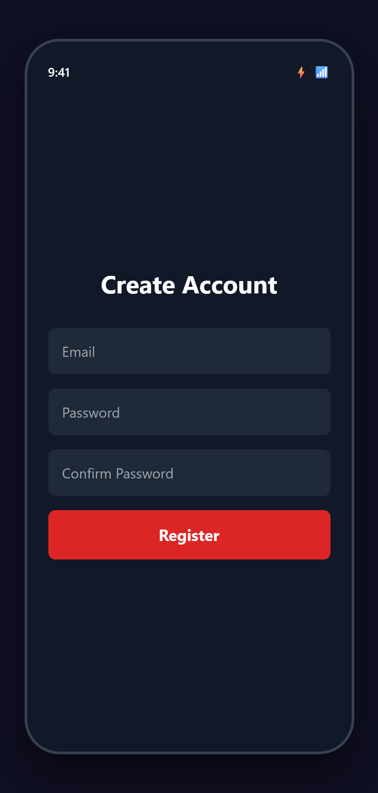
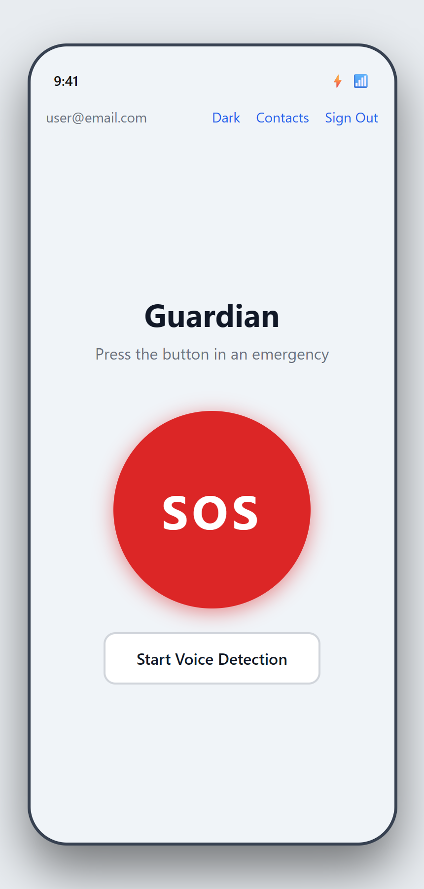
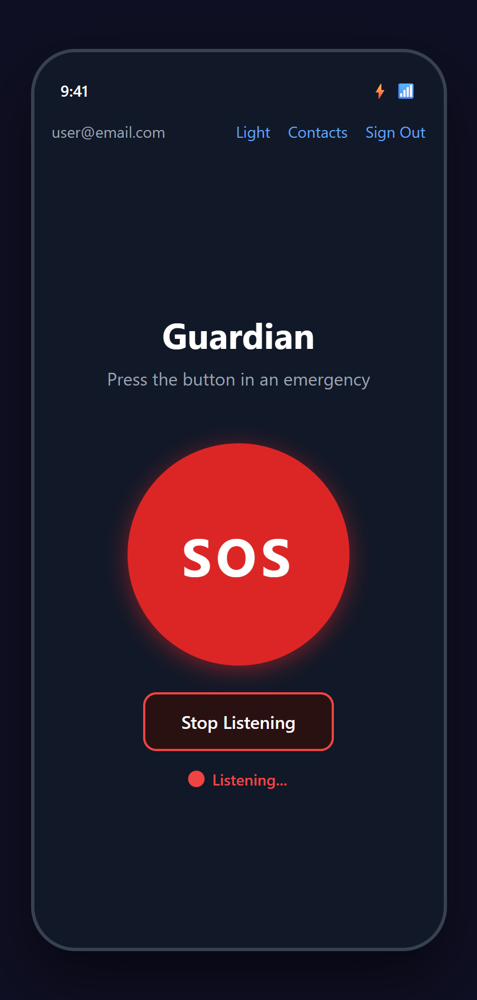
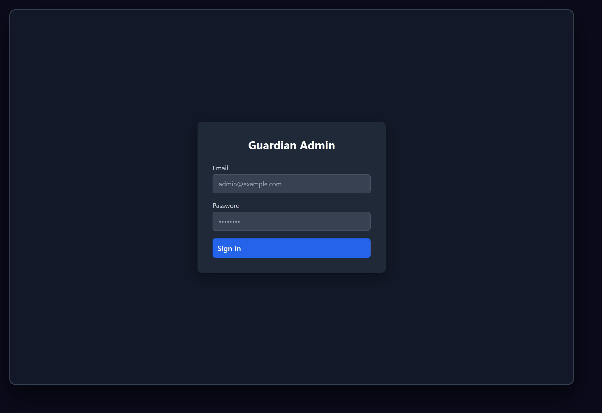
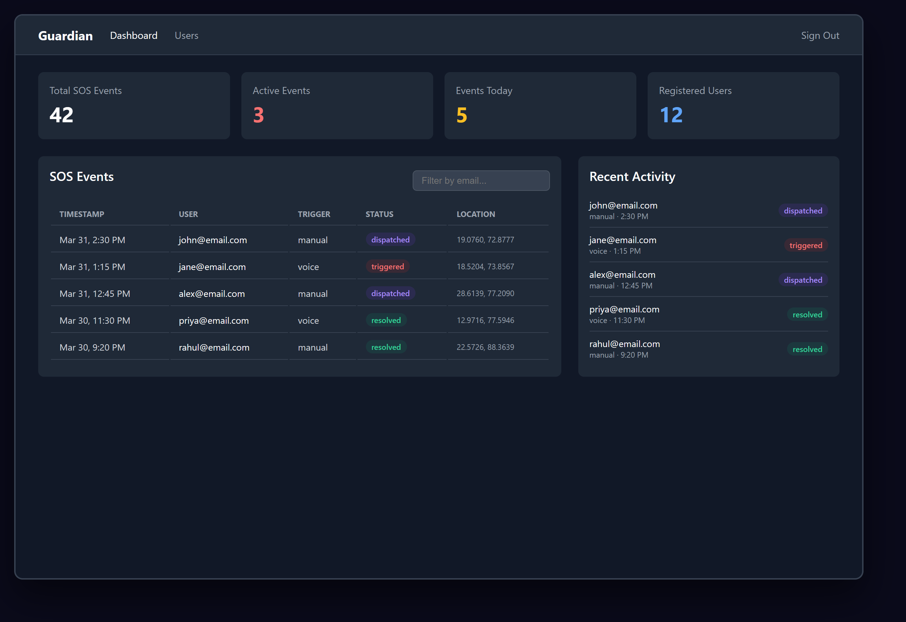
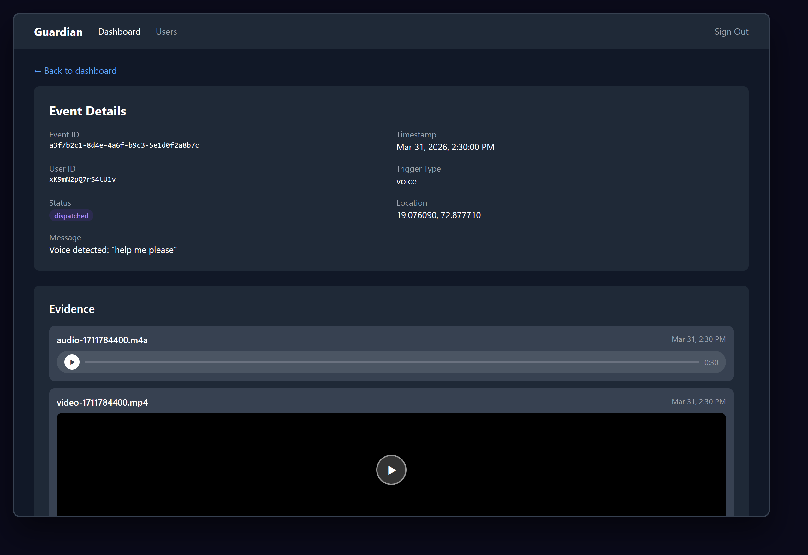
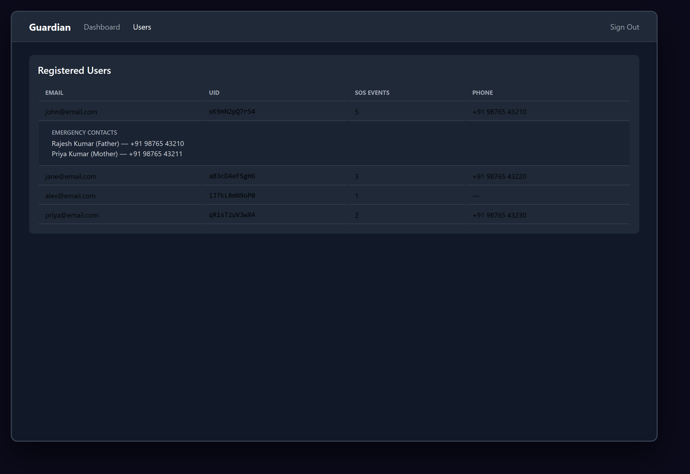
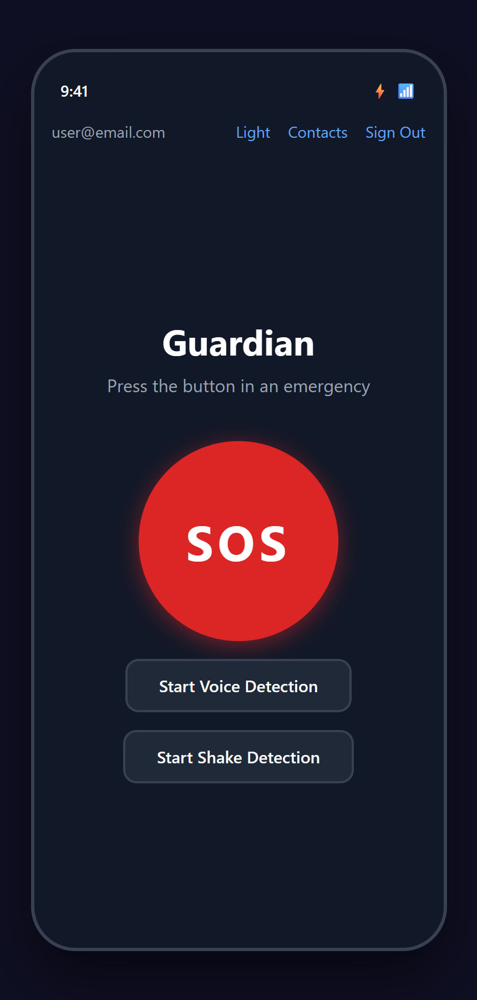
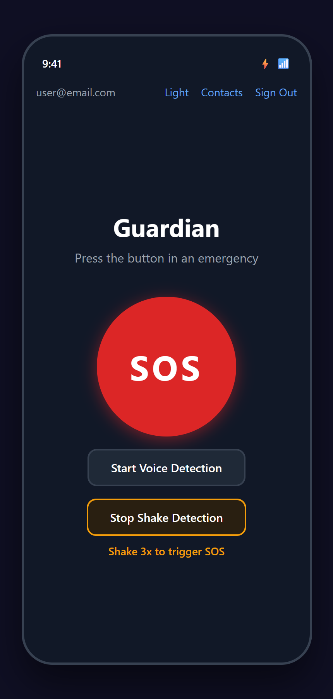
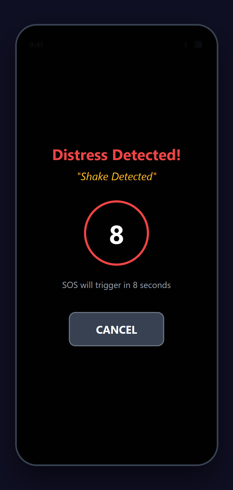

# Project Guardian — Comprehensive Project Documentation

## AI-Powered Smart Mobile Safety System

<p align="center">
  
</p>

<p align="center">
  <strong>Guardian</strong> — An AI-powered mobile safety application that enables one-tap SOS alerts,<br/>
  voice-activated emergency triggering, shake-based distress detection,<br/>
  automatic evidence recording, and real-time location tracking.
</p>

---

# Table of Contents

1. [Problem Statement](#chapter-1-problem-statement)
2. [Project Overview & Objectives](#chapter-2-project-overview--objectives)
3. [System Architecture](#chapter-3-system-architecture)
4. [Technology Stack & Tools](#chapter-4-technology-stack--tools)
5. [Implementation Plan](#chapter-5-implementation-plan)
6. [Phase 1: Core SOS & Location Tracking](#chapter-6-phase-1-core-sos--location-tracking)
7. [Phase 2: AI Voice Detection](#chapter-7-phase-2-ai-voice-detection)
8. [Phase 3: Evidence Collection & Cloud Upload](#chapter-8-phase-3-evidence-collection--cloud-upload)
9. [Phase 4A: Admin Dashboard](#chapter-9-phase-4a-admin-dashboard)
10. [Phase 4B: Advanced Dashboard Features](#chapter-10-phase-4b-advanced-dashboard-features)
11. [Phase 5A: Shake Detection](#chapter-11-phase-5a-shake-detection)
12. [Integration Processes](#chapter-12-integration-processes)
13. [Deployment & DevOps](#chapter-13-deployment--devops)
14. [Security Implementation](#chapter-14-security-implementation)
15. [Testing & Verification](#chapter-15-testing--verification)
16. [Future Scope](#chapter-16-future-scope)
17. [Appendix A: Environment Setup Guide](#appendix-a-environment-setup-guide)
18. [Appendix B: API Reference](#appendix-b-api-reference)
19. [Appendix C: Application Screenshots Gallery](#appendix-c-application-screenshots-gallery)

---

# Chapter 1: Problem Statement

## 1.1 Background

Personal safety remains a critical concern worldwide. In emergency situations — such as physical threats, medical emergencies, or natural disasters — victims often face the following challenges:

- **Inability to make a phone call** — The person may be physically restrained, injured, or in a situation where making a visible call would escalate danger.
- **No hands-free emergency trigger** — Traditional emergency calls require manual dialing, which may not be possible.
- **Lack of evidence** — In many cases, victims cannot document the situation, making it harder for authorities to respond effectively.
- **Delayed contact notification** — Family members and emergency contacts are often notified too late.
- **No real-time tracking** — Responders do not have access to the victim's live location.

## 1.2 Problem Definition

There is a need for a **smart, AI-powered mobile safety application** that:

1. Allows users to trigger emergency alerts with a **single button press**
2. Supports **voice-activated SOS** — detecting distress keywords like "help", "emergency", "save me" without requiring the user to interact with the phone
3. Supports **shake-based SOS** — detecting rapid phone shaking for hands-free triggering when the user cannot speak or look at the screen
4. **Automatically records evidence** (audio, video, photos) when an SOS is triggered
5. **Notifies emergency contacts** instantly via SMS and push notifications with the user's live location
6. Provides an **admin dashboard** for real-time monitoring of all SOS events
7. Works **offline-first** — stores evidence locally and uploads when connectivity is available

## 1.3 Target Users

| User Type | Description |
|-----------|-------------|
| **Primary Users** | Individuals seeking personal safety (students, travelers, women, elderly) |
| **Emergency Contacts** | Family members, friends, or guardians who receive SOS alerts |
| **Administrators** | Organization admins monitoring safety events via web dashboard |

---

# Chapter 2: Project Overview & Objectives

## 2.1 Project Name

**Guardian** — AI-Powered Smart Mobile Safety System

<p align="center">
  
</p>

## 2.2 Objectives

| # | Objective | Status |
|---|-----------|--------|
| 1 | One-tap SOS emergency trigger with location sharing | Completed |
| 2 | AI-powered voice detection for hands-free SOS | Completed |
| 3 | Shake-based SOS triggering (3 shakes in 2 seconds) | Completed |
| 4 | Automatic evidence recording (audio + video + photos) | Completed |
| 5 | Instant SMS and push notification alerts to contacts | Completed |
| 6 | Real-time location tracking on map | Completed |
| 7 | Cloud-based evidence storage with offline-first approach | Completed |
| 8 | Admin web dashboard with analytics and event management | Completed |
| 9 | Light/Dark mode UI support | Completed |

## 2.3 Project Structure

```
Project Guardian (Monorepo)
├── mobile/            — React Native (Expo) mobile application
├── backend/           — FastAPI (Python) REST API server
├── dashboard/         — React (Vite + TailwindCSS) admin web app
├── shared-schemas/    — TypeScript type definitions shared across workspaces
├── ai-services/       — AI model services (Whisper integration)
├── scripts/           — DevOps and utility scripts
├── docs/              — Design specs and documentation
└── firebase.json      — Firebase Hosting configuration
```

---

# Chapter 3: System Architecture

## 3.1 High-Level Architecture Diagram

```
┌──────────────────────────────────────────────────────────────────────┐
│                        MOBILE APP (Expo)                             │
│  ┌──────────┐  ┌──────────┐  ┌──────────┐  ┌──────────────────┐    │
│  │ SOS      │  │ Voice    │  │ Shake    │  │ Evidence         │    │
│  │ Button   │  │ Detection│  │ Detection│  │ Recorder         │    │
│  └────┬─────┘  └────┬─────┘  └────┬─────┘  └───────┬──────────┘    │
│       │              │             │                 │               │
│  ┌────┴──────────────┴─────────────┴─────────────────┘               │
│  │                  Countdown Overlay (10s)                          │
│  └────┬──────────────────────────────────────────────────────────┐   │
│       │                                                          │   │
│  ┌────┴─────┐                                          ┌────────┴┐  │
│  │ Location │                                          │ Firebase │  │
│  │ Tracker  │                                          │ Storage  │  │
│  └────┬─────┘                                          └────────┬┘  │
└───────┼──────────────────────────────────────────────────────────┼───┘
        │                                                          │
        ▼                                                          ▼
┌───────────────┐                                      ┌──────────────┐
│ FastAPI       │                                      │ Firebase     │
│ Backend       │                                      │ Storage      │
│ (Render)      │                                      │ (Evidence)   │
│               │                                      └──────────────┘
│ ┌───────────┐ │
│ │ Twilio    │ │        ┌──────────────────────────────┐
│ │ SMS API   │ │        │      FIREBASE SERVICES       │
│ └───────────┘ │        │  ┌──────┐ ┌────────┐        │
│ ┌───────────┐ │◄──────►│  │ Auth │ │Firestore│        │
│ │ Firebase  │ │        │  └──────┘ └────────┘        │
│ │ Admin SDK │ │        │  ┌──────┐ ┌────────┐        │
│ └───────────┘ │        │  │ FCM  │ │Hosting │        │
│ ┌───────────┐ │        │  └──────┘ └────────┘        │
│ │ FCM Push  │ │        └──────────────────────────────┘
│ └───────────┘ │                    ▲
└───────────────┘                    │
                          ┌──────────┴──────────┐
                          │  ADMIN DASHBOARD     │
                          │  (React + Vite)      │
                          │  Firebase Hosting    │
                          │                      │
                          │  ┌────────────────┐  │
                          │  │ Analytics      │  │
                          │  │ Map View       │  │
                          │  │ CSV Export     │  │
                          │  │ Status Mgmt   │  │
                          │  └────────────────┘  │
                          └─────────────────────┘
```

## 3.2 SOS Event Flow

```
Step 1: TRIGGER
   User presses SOS button / voice keyword detected / phone shaken 3x
        │
Step 2: COUNTDOWN (voice & shake only)
   10-second countdown overlay with CANCEL option
        │
Step 3: LOCATION CAPTURE
   GPS coordinates captured via expo-location (high accuracy)
        │
Step 4: API CALL
   POST /sos/trigger → FastAPI backend on Render
        │
Step 5: EVENT CREATION
   Backend stores event in Firestore (sos_events collection)
        │
Step 6: NOTIFICATIONS
   ├── Twilio SMS → Emergency contacts receive SMS with Google Maps link
   └── FCM Push  → Push notification sent to contacts' devices
        │
Step 7: EVIDENCE RECORDING
   ├── Audio recording starts (30 seconds, auto)
   ├── Video recording starts (15 seconds, auto)
   └── User can manually capture photos after recording
        │
Step 8: EVIDENCE UPLOAD
   Files uploaded to Firebase Storage → Metadata written to Firestore
        │
Step 9: LIVE TRACKING
   Real-time location updates on map (every 5 seconds)
```

## 3.3 Data Flow Diagram

```
Mobile App ──POST /sos/trigger──► FastAPI Backend
                                      │
                                      ├──► Firestore (sos_events record)
                                      ├──► Twilio (emergency SMS)
                                      └──► FCM (push notifications)

Mobile App ──direct──► Firestore (users, contacts CRUD)
Mobile App ──direct──► Firebase Storage (evidence upload)
Mobile App ──direct──► Google Maps API (live tracking)

Dashboard  ──direct──► Firestore (onSnapshot real-time reads + status writes)
Dashboard  ──direct──► Firebase Auth (admin login)
Dashboard  ──direct──► Firebase Storage (evidence playback)
```

---

# Chapter 4: Technology Stack & Tools

## 4.1 Mobile Application

| Technology | Version | Purpose |
|-----------|---------|---------|
| React Native | 0.81.5 | Cross-platform mobile framework |
| Expo SDK | ~53.0 | Managed workflow, build tools, native APIs |
| TypeScript | ^5.8.3 | Static type checking |
| expo-location | ~18.1.5 | GPS location access |
| expo-camera | ~17.0.10 | Video recording & photo capture |
| expo-av | ~15.1.4 | Audio recording & playback |
| expo-speech-recognition | latest | On-device voice detection |
| expo-sensors | latest | Accelerometer for shake detection |
| expo-file-system | ~19.0.21 | Local file storage |
| expo-notifications | ~0.32.4 | Push notification handling |
| react-native-maps | 1.20.1 | Interactive map display |
| @react-navigation/native-stack | ^7.3.14 | Screen navigation |
| firebase (JS SDK) | 12.11.0 | Auth, Firestore, Storage |
| AsyncStorage | ^2.2.0 | Theme preference persistence |

## 4.2 Backend Server

| Technology | Version | Purpose |
|-----------|---------|---------|
| Python | 3.12+ | Backend programming language |
| FastAPI | ^0.115.12 | Async REST API framework |
| Uvicorn | ^0.34.2 | ASGI server |
| Poetry | latest | Dependency management |
| firebase-admin | ^6.7.0 | Server-side Firebase access |
| Twilio | ^9.5.2 | SMS delivery |
| OpenAI | ^1.68.2 | Whisper voice transcription (backup) |
| Pydantic | latest | Request/response validation |
| Ruff | latest | Python linting & formatting |

## 4.3 Admin Dashboard

| Technology | Version | Purpose |
|-----------|---------|---------|
| React | 19.1.0 | UI component library |
| Vite | 6.4.1 | Build tool & dev server |
| TailwindCSS | 4.1.3 | Utility-first CSS framework |
| react-router-dom | 7.5.0 | Client-side routing |
| Firebase (JS SDK) | 11.6.0 | Auth, Firestore, Storage |
| TypeScript | 5.8.3 | Static type checking |
| Leaflet + react-leaflet | latest | Interactive map component |
| Recharts | latest | Analytics charts (area, donut) |

## 4.4 Cloud Services & APIs

| Service | Provider | Purpose |
|---------|----------|---------|
| Firebase Authentication | Google | User auth (email/password) |
| Cloud Firestore | Google | NoSQL database for events, users, admins |
| Firebase Storage | Google | Evidence file storage (audio/video/photos) |
| Firebase Cloud Messaging | Google | Push notifications to contacts |
| Firebase Hosting | Google | Admin dashboard deployment |
| Twilio | Twilio Inc. | Emergency SMS delivery |
| Google Maps API | Google | Location URL generation |
| Render | Render Inc. | Backend API hosting |
| Expo Application Services | Expo | Mobile app build & distribution |
| expo-speech-recognition | Google (on-device) | Free on-device speech-to-text |

## 4.5 Development Tools

| Tool | Purpose |
|------|---------|
| Git + GitHub | Version control & repository hosting |
| npm Workspaces | Monorepo dependency management |
| EAS CLI | Expo build & submit commands |
| Firebase CLI | Hosting deployment |
| Ruff | Python linter & formatter |
| ESLint | TypeScript/JavaScript linter |

---

# Chapter 5: Implementation Plan

## 5.1 Phase Overview

```
Phase 1 (Weeks 1-3): Core SOS & Location Tracking          ✅ Completed
    └── SOS button, location, Twilio SMS, FCM push, contacts management

Phase 2 (Weeks 4-6): AI Voice Detection                    ✅ Completed
    └── On-device speech recognition, keyword detection, countdown overlay

Phase 3 (Weeks 7-9): Evidence Collection & Cloud Upload     ✅ Completed
    └── Auto audio/video recording, Firebase Storage, offline-first upload

Phase 4A (Weeks 10-11): Admin Dashboard                     ✅ Completed
    └── Web dashboard, real-time monitoring, evidence viewer, user management

Phase 4B (Week 12): Advanced Dashboard Features             ✅ Completed
    └── Status management, interactive maps, CSV export, analytics charts

Phase 5A (Week 13): Shake Detection                         ✅ Completed
    └── Accelerometer-based shake trigger, 3-shake detection, countdown
```

## 5.2 Detailed Task Breakdown

### Phase 1 Tasks
1. Set up monorepo with npm workspaces
2. Create shared TypeScript type definitions
3. Build FastAPI backend with health check
4. Implement Firebase Auth middleware
5. Create SOS trigger endpoint
6. Integrate Twilio SMS service
7. Build React Native app with SOS button
8. Implement location tracking (expo-location)
9. Add Google Maps live tracking screen
10. Implement FCM push notifications
11. Build emergency contacts management screen
12. Deploy backend to Render
13. Build standalone APK via EAS

### Phase 2 Tasks
1. Implement voice recording with expo-av (5-second chunks)
2. Build voice detection hook (useVoiceDetection)
3. Create countdown overlay component
4. Integrate OpenAI Whisper API for transcription
5. Implement distress keyword matching
6. Add voice detection toggle to HomeScreen
7. Switch to on-device speech recognition (expo-speech-recognition)

### Phase 3 Tasks
1. Define evidence type schemas
2. Build local evidence storage service
3. Implement auto audio recording (30 seconds)
4. Implement auto video recording (15 seconds)
5. Build Firebase Storage upload pipeline
6. Create evidence manifest tracking system
7. Build evidence list component with upload status
8. Add manual photo capture functionality
9. Implement offline-first upload with retry

### Phase 4A Tasks
1. Scaffold dashboard workspace (Vite + React + TailwindCSS)
2. Configure Firebase for dashboard (VITE_ env vars)
3. Build admin auth with whitelist verification
4. Create protected routes and app router
5. Build real-time data hooks (useEvents, useUsers, useStats)
6. Create stats bar component
7. Build events table with filtering
8. Create activity feed with live updates
9. Build event detail page with evidence player
10. Build users page with contact expansion
11. Configure Firebase Hosting and deploy

### Phase 4B Tasks
1. Add event status management (Acknowledge/Resolve actions)
2. Integrate Leaflet map on event detail page
3. Build CSV export with proper escaping and BOM
4. Add area chart (events over time, last 30 days)
5. Add donut chart (trigger type distribution)
6. Deploy updated dashboard to Firebase Hosting

### Phase 5A Tasks
1. Create useShakeDetection hook with expo-sensors Accelerometer
2. Add shake toggle button to HomeScreen (amber styling)
3. Integrate shake detection with CountdownOverlay
4. Handle shake/voice detection state in handleCountdownConfirm/Cancel
5. Build and deploy updated APK via EAS

---

# Chapter 6: Phase 1 - Core SOS & Location Tracking

## 6.1 Backend Setup

### Step 1: Project Initialization

```bash
mkdir backend && cd backend
poetry init --name guardian-backend
poetry add fastapi uvicorn firebase-admin twilio pydantic-settings httpx
```

### Step 2: FastAPI Application Structure

```
backend/
├── app/
│   ├── main.py              # FastAPI app entry point
│   ├── config.py             # Settings from environment
│   ├── firebase_init.py      # Firebase Admin SDK setup
│   ├── middleware/
│   │   └── auth.py           # Firebase token verification
│   ├── routers/
│   │   ├── health.py         # GET /health
│   │   └── sos.py            # POST /sos/trigger, POST /sos/voice-detect
│   ├── services/
│   │   ├── firebase_service.py    # Firestore operations
│   │   ├── twilio_service.py      # SMS sending
│   │   ├── location_service.py    # Maps URL generation
│   │   └── whisper_service.py     # Voice transcription
│   └── models/
│       └── sos_event.py           # Pydantic models
├── pyproject.toml
└── Dockerfile
```

### Step 3: SOS Trigger Endpoint Implementation

The `/sos/trigger` endpoint is the core of the system:

```
POST /sos/trigger
├── Input:  { userId, location, triggerType, message }
├── Auth:   Firebase ID token (Bearer)
├── Process:
│   1. Generate event UUID
│   2. Store in Firestore sos_events collection
│   3. Fetch user's emergency contacts
│   4. Generate Google Maps URL
│   5. Send Twilio SMS to all contacts
│   6. Send FCM push notifications
├── Output: { eventId, status: "dispatched" }
```

### Step 4: Firebase Admin SDK Configuration

Two deployment modes are supported:

```python
# Local development - JSON file
FIREBASE_SERVICE_ACCOUNT_PATH=./firebase-service-account.json

# Cloud deployment - JSON string in env var
FIREBASE_SERVICE_ACCOUNT_JSON={"type":"service_account",...}
```

### Step 5: Twilio SMS Integration

```
SMS Message Format:
┌─────────────────────────────────────────────┐
│ SOS ALERT!                                  │
│ Emergency triggered.                         │
│ Location: https://google.com/maps?q=lat,lng │
│ Message: Emergency SOS triggered             │
└─────────────────────────────────────────────┘
```

## 6.2 Mobile Application Setup

### Step 1: Expo Project Initialization

```bash
npx create-expo-app mobile --template blank-typescript
cd mobile
npx expo install expo-location expo-notifications react-native-maps
npm install firebase @react-navigation/native @react-navigation/native-stack
```

### Step 2: Firebase Client Configuration

```typescript
// mobile/src/services/firebase.ts
const firebaseConfig = {
  apiKey:            process.env.EXPO_PUBLIC_FIREBASE_API_KEY,
  authDomain:        process.env.EXPO_PUBLIC_FIREBASE_AUTH_DOMAIN,
  projectId:         process.env.EXPO_PUBLIC_FIREBASE_PROJECT_ID,
  storageBucket:     process.env.EXPO_PUBLIC_FIREBASE_STORAGE_BUCKET,
  messagingSenderId: process.env.EXPO_PUBLIC_FIREBASE_MESSAGING_SENDER_ID,
  appId:             process.env.EXPO_PUBLIC_FIREBASE_APP_ID,
};
```

### Step 3: Navigation Structure

```
RootNavigator
├── ThemeProvider (light/dark mode)
│   └── AuthProvider (Firebase Auth state)
│       └── NavigationContent
│           ├── IF authenticated:
│           │   └── AppStack
│           │       ├── Home (SOS button, voice/shake detection)
│           │       ├── Status (evidence, recording status)
│           │       ├── Contacts (emergency contact management)
│           │       └── Tracking (live map view)
│           └── ELSE:
│               └── AuthStack
│                   ├── Login
│                   └── Register
```

### Step 4: Login & Registration Screens

The authentication flow starts with a clean login screen. Users can sign in with email/password or navigate to the registration screen.

<p align="center">
  
  &nbsp;&nbsp;&nbsp;&nbsp;
  
</p>
<p align="center"><em>Figure 6.1: Login Screen (left) and Registration Screen (right)</em></p>

### Step 5: SOS Button & Home Screen

The SOS button is a large red circular button (200x200px) centered on the Home Screen. It triggers the full emergency flow with a single tap. The app supports both dark and light mode themes.

<p align="center">
  
  &nbsp;&nbsp;&nbsp;&nbsp;
  
</p>
<p align="center"><em>Figure 6.2: Home Screen in Dark Mode (left) and Light Mode (right)</em></p>

**SOS Button Specifications:**
- Size: 200x200px circular
- Color: #DC2626 (red) with shadow elevation
- Text: "SOS" in 48pt bold white
- Accessibility label: "Emergency SOS Button"
- Disabled state: gray (#9CA3AF) when already triggered

### Step 6: Location Tracking Implementation

```
expo-location Configuration:
├── Permission: ACCESS_FINE_LOCATION + ACCESS_COARSE_LOCATION
├── Accuracy: High (GPS + Network)
├── Update Interval: 5 seconds
├── Distance Interval: 10 meters minimum
└── Map Display: react-native-maps with red marker
```

<p align="center">
  
</p>
<p align="center"><em>Figure 6.3: Live Location Tracking with Map View</em></p>

The tracking screen displays a real-time map with the user's location marked by a red pin. An overlay panel at the bottom shows the event ID and current GPS coordinates, updating every 5 seconds.

### Step 7: Emergency Contacts Screen

Users can manage their emergency contacts — adding name, phone number, and relationship. Contacts are stored in Firestore under the user's document and are retrieved when an SOS is triggered.

<p align="center">
  
</p>
<p align="center"><em>Figure 6.4: Emergency Contacts Management Screen</em></p>

**Features:**
- List of saved contacts with name, phone, and relationship
- Remove button for each contact
- Add Contact form with validation
- Data stored in Firestore: `users/{uid}/emergency_contacts`

## 6.3 Deployment

### Backend → Render

```bash
# Dockerfile builds the FastAPI app
# Render auto-deploys from GitHub main branch
# Environment variables set in Render dashboard:
#   FIREBASE_PROJECT_ID
#   FIREBASE_SERVICE_ACCOUNT_JSON
#   TWILIO_ACCOUNT_SID
#   TWILIO_AUTH_TOKEN
#   TWILIO_FROM_PHONE
```

### Mobile → Standalone APK (EAS Build)

```bash
cd mobile
eas build --platform android --profile preview
# Generates .apk for sideloading/testing
```

---

# Chapter 7: Phase 2 - AI Voice Detection

## 7.1 Overview

Voice detection enables hands-free SOS triggering. The system listens for distress keywords and automatically triggers the SOS flow with a 10-second confirmation countdown.

## 7.2 Architecture Evolution

The voice detection system went through two implementations:

### Version 1: Cloud-Based (OpenAI Whisper)
```
Record 5s audio chunk → Upload to backend → Whisper API transcription → Keyword match
```
- **Issue:** Requires paid OpenAI API credits ($0.006/minute)
- **Status:** Deprecated (kept as backend fallback)

### Version 2: On-Device (expo-speech-recognition) — Current
```
Device microphone → Google Speech Engine (on-device) → Real-time transcript → Keyword match
```
- **Advantage:** Completely free, faster, works offline
- **Engine:** Uses Android's built-in Google Speech Recognition

## 7.3 Distress Keywords

```
English:           Hindi:
├── help           └── bachao
├── help me
├── emergency
├── call the police
├── someone help
├── save me
├── danger
├── stop
├── sos
└── please help
```

## 7.4 Voice Detection Flow

```
┌──────────────────────────────────────────┐
│ User taps "Start Voice Detection"         │
└──────────────┬───────────────────────────┘
               │
               ▼
┌──────────────────────────────────────────┐
│ Request microphone permission             │
└──────────────┬───────────────────────────┘
               │
               ▼
┌──────────────────────────────────────────┐
│ Start continuous speech recognition       │
│ contextualStrings: [distress keywords]    │
└──────────────┬───────────────────────────┘
               │
               ▼
┌──────────────────────────────────────────┐
│ Listen continuously...                    │
│ On each result event:                     │
│   Extract transcript                      │
│   Check against keyword list              │
└──────┬──────────────────┬────────────────┘
       │                  │
   No match           Match found!
       │                  │
       ▼                  ▼
   Continue          ┌────────────────────┐
   listening         │ Stop recognition    │
                     │ Show Countdown      │
                     │ Overlay (10 sec)    │
                     └────┬──────────┬─────┘
                          │          │
                     User          Timer
                    cancels       expires
                          │          │
                          ▼          ▼
                    Resume       Trigger
                    listening    SOS event
```

## 7.5 Voice Listening State

When voice detection is active, a pulsing red indicator shows that the app is listening. The "Start Voice Detection" button changes to "Stop Listening" with a red border.

<p align="center">
  
</p>
<p align="center"><em>Figure 7.1: Voice Detection Active — Listening for Distress Keywords</em></p>

## 7.6 Countdown Overlay

When a distress keyword is detected, a full-screen countdown overlay appears with a 10-second timer. The user can cancel before the timer expires. If not cancelled, the SOS is automatically triggered.

<p align="center">
  
</p>
<p align="center"><em>Figure 7.2: Countdown Overlay — "help me" Detected, 7 Seconds Remaining</em></p>

**Countdown Overlay Features:**
- Full-screen dark overlay (95% opacity)
- Detected keyword displayed in yellow
- Large countdown circle with timer (red border)
- Device vibration pattern on activation
- "CANCEL" button to abort and resume listening
- Auto-triggers SOS when timer reaches 0

## 7.7 Implementation Steps

1. Install `expo-speech-recognition` package
2. Add config plugin to `app.json` with permission strings
3. Create `useVoiceDetection` hook with continuous recognition
4. Implement keyword matching function (case-insensitive substring)
5. Build `CountdownOverlay` component with 10-second timer
6. Build `VoiceIndicator` component (pulsing red dot)
7. Integrate toggle button in HomeScreen
8. Handle auto-restart on recognition end events
9. Handle error recovery (restart on transient errors)

---

# Chapter 8: Phase 3 - Evidence Collection & Cloud Upload

## 8.1 Overview

When an SOS event is triggered, the app automatically records evidence:
- **Audio:** 30 seconds of ambient audio
- **Video:** 15 seconds of video from rear camera
- **Photos:** Manual capture after auto-recording completes

All evidence is stored locally first (offline-first), then uploaded to Firebase Storage.

## 8.2 Recording Architecture

```
SOS Triggered
     │
     ├──► Audio Recording (expo-av)
     │    ├── Format: M4A (AAC codec)
     │    ├── Sample Rate: 16kHz, Mono
     │    ├── Duration: 30 seconds
     │    └── Auto-stop after timer
     │
     ├──► Video Recording (expo-camera)
     │    ├── Format: MP4
     │    ├── Camera: Rear (back-facing)
     │    ├── Duration: 15 seconds
     │    ├── Hidden CameraView (1x1px, opacity 0)
     │    └── Auto-stop after timer
     │
     └──► Photo Capture (manual, after recording)
          ├── Full camera view opens
          ├── Quality: 0.8
          └── Format: JPEG
```

## 8.3 Status Screen with Evidence

After an SOS is triggered, the Status Screen shows real-time recording progress and evidence upload status. Each evidence file is listed with its upload state.

<p align="center">
  
</p>
<p align="center"><em>Figure 8.1: Status Screen — Recording in Progress with Evidence Upload Status</em></p>

**Status Screen Features:**
- "SOS Triggered" header with "Help is on the way" confirmation
- Event ID displayed in monospace font
- **Recording Indicator** — pulsing red dot with countdown timers for audio (30s) and video (15s)
- **Evidence List** — each file shows type icon, filename, timestamp, and upload status
- Upload status icons: ✓ (uploaded), spinner (uploading), ⏳ (pending), ↻ (failed/retry)
- "Retry All" button for failed uploads

## 8.4 Camera View for Photo Capture

After auto-recording completes, users can take additional photos using a full-screen camera view with capture and cancel controls.

<p align="center">
  
</p>
<p align="center"><em>Figure 8.2: Photo Capture Camera View</em></p>

## 8.5 Storage Architecture (Offline-First)

```
Local Device Storage:
└── ${documentDirectory}/evidence/
    └── {eventId}/
        ├── manifest.json          ← Tracks upload status
        ├── audio-1711784400000.m4a
        ├── video-1711784400000.mp4
        └── photo-1711784415000.jpg

manifest.json:
{
  "eventId": "abc-123",
  "userId": "user-456",
  "items": [
    {
      "type": "audio",
      "filename": "audio-1711784400000.m4a",
      "localUri": "file:///...",
      "uploadStatus": "uploaded",    ← pending | uploading | uploaded | failed
      "url": "https://firebasestorage.googleapis.com/...",
      "createdAt": 1711784400000
    }
  ]
}
```

## 8.6 Firebase Storage Structure

```
Firebase Storage Bucket:
└── evidence/
    └── {userId}/
        └── {eventId}/
            ├── audio-1711784400000.m4a
            ├── video-1711784400000.mp4
            └── photo-1711784415000.jpg
```

## 8.7 Upload Pipeline

```
┌─────────────────────────────────────────┐
│ Evidence File Ready (local)              │
└──────────────┬──────────────────────────┘
               │
               ▼
┌─────────────────────────────────────────┐
│ Update manifest: status = "uploading"    │
└──────────────┬──────────────────────────┘
               │
               ▼
┌─────────────────────────────────────────┐
│ Read file as base64                      │
│ Convert to Blob                          │
│ Upload via uploadBytesResumable()        │
└──────┬──────────────────┬───────────────┘
       │                  │
   Success              Error
       │                  │
       ▼                  ▼
┌──────────────┐  ┌──────────────────────┐
│ Get download │  │ Mark status "failed"  │
│ URL          │  │ Retry later           │
│              │  └──────────────────────┘
│ Write to     │
│ Firestore    │
│ (arrayUnion) │
│              │
│ Mark status  │
│ "uploaded"   │
└──────────────┘
```

---

# Chapter 9: Phase 4A - Admin Dashboard

## 9.1 Overview

A web-based admin dashboard for real-time monitoring of SOS events, deployed on Firebase Hosting. Built with React, Vite, and TailwindCSS with a dark theme.

## 9.2 Technology Choice

| Decision | Choice | Reason |
|----------|--------|--------|
| Framework | React + Vite | Fast builds, modern tooling |
| Styling | TailwindCSS v4 | Utility-first, dark theme support |
| Routing | react-router-dom v7 | Client-side SPA navigation |
| Data | Direct Firestore (no backend) | Real-time onSnapshot subscriptions |
| Auth | Firebase Auth + admin whitelist | Simple, secure admin check |
| Hosting | Firebase Hosting | Free, automatic SSL, SPA support |

## 9.3 Admin Authentication Flow

```
User enters email/password
         │
         ▼
Firebase Auth (signInWithEmailAndPassword)
         │
         ▼
Check Firestore: admins/{uid} document exists?
    │                           │
   YES                         NO
    │                           │
    ▼                           ▼
Grant access             Sign out user
Show dashboard          Show "Access denied"
```

### Admin Login Screen

<p align="center">
  
</p>
<p align="center"><em>Figure 9.1: Admin Dashboard Login Page</em></p>

## 9.4 Dashboard Pages

### Dashboard Home (`/`)

The main dashboard displays four key stat cards at the top, an SOS events table with email filtering, and a recent activity feed — all updating in real-time via Firestore onSnapshot subscriptions.

<p align="center">
  
</p>
<p align="center"><em>Figure 9.2: Admin Dashboard — Stats Bar, Events Table, and Activity Feed</em></p>

**Dashboard Components:**
- **Stats Bar** — Four cards showing: Total SOS Events, Active Events (red), Events Today (yellow), Registered Users (blue)
- **Events Table** — Sortable table with columns: Timestamp, User, Trigger Type, Status (color-coded badge), Location. Includes email filter input
- **Activity Feed** — Latest 10 events with user, trigger type, time, and status badge
- All data updates in real-time without page refresh

### Event Detail Page (`/events/:eventId`)

Clicking an event row navigates to its detail page, showing full metadata and evidence player with audio/video/photo playback.

<p align="center">
  
</p>
<p align="center"><em>Figure 9.3: Event Detail Page — Metadata, Audio Player, Video Player, Photo Preview</em></p>

**Event Detail Features:**
- Back navigation link
- Event metadata grid: ID, timestamp, user, trigger type, status badge, location, message
- **Evidence Player:**
  - Audio files: HTML5 audio player with controls
  - Video files: HTML5 video player with controls
  - Photos: Full-width preview with click-to-open-in-new-tab

### Users Page (`/users`)

Lists all registered users with their SOS event count. Clicking a user row expands to show their emergency contacts.

<p align="center">
  
</p>
<p align="center"><em>Figure 9.4: Users Page — User List with Expandable Emergency Contacts</em></p>

**Users Page Features:**
- Table with columns: Email, UID, SOS Events count, Phone
- Expandable rows showing emergency contacts (name, relationship, phone)
- Real-time data via Firestore subscription

## 9.5 Real-Time Data Hooks

```typescript
// useEvents — Real-time Firestore subscription
const q = query(collection(db, 'sos_events'), orderBy('created_at', 'desc'));
onSnapshot(q, (snapshot) => {
  // Map snake_case Firestore fields to camelCase TypeScript types
  // Updates automatically when new events are created
});

// useUsers — Real-time users subscription
onSnapshot(collection(db, 'users'), (snapshot) => {
  // Updates automatically when users register or update profiles
});

// useStats — Computed from events
{
  totalEvents: events.length,
  activeEvents: events.filter(e => e.status === 'triggered' || 'dispatched'),
  eventsToday: events.filter(e => e.createdAt >= startOfDay),
  totalUsers: users.length,
}
```

## 9.6 Deployment Steps

```bash
# 1. Create .env with VITE_ prefixed Firebase config
# 2. Build the dashboard
cd dashboard && npx vite build

# 3. Initialize Firebase project
firebase login
firebase init hosting  # public: dashboard/dist, SPA: yes

# 4. Deploy
firebase deploy --only hosting
```

---

# Chapter 10: Phase 4B - Advanced Dashboard Features

## 10.1 Overview

Phase 4B adds four advanced features to the admin dashboard: event status management, interactive maps, CSV export, and analytics charts.

## 10.2 Event Status Management

Admins can now change event status directly from the Event Detail page. Two action buttons are available:

- **Acknowledge** — Visible when status is `triggered` or `dispatched`. Marks the event as being reviewed.
- **Resolve** — Available for any non-resolved event. Marks the event as handled.

Both actions include a confirmation dialog and update the Firestore document's `status` and `updated_at` fields in real-time. Actions are hidden once the event reaches `resolved` status.

### Implementation

```typescript
// dashboard/src/lib/firestore.ts
export async function updateEventStatus(eventId: string, status: SOSStatus): Promise<void> {
  const ref = doc(db, 'sos_events', eventId);
  await updateDoc(ref, { status, updated_at: Date.now() });
}
```

## 10.3 Interactive Map (Leaflet + OpenStreetMap)

Each event's GPS coordinates are displayed on an interactive map powered by Leaflet with OpenStreetMap tiles. The map includes:
- Zoom controls
- Draggable/scrollable navigation
- Blue marker at event location with coordinate popup
- No API key required (uses free OpenStreetMap)

<p align="center">
  
</p>
<p align="center"><em>Figure 10.1: Event Detail Page with Acknowledge/Resolve Actions and Interactive Map</em></p>

## 10.4 CSV Export

The Events Table now includes an "Export CSV" button that downloads the currently filtered events as a CSV file. Features:
- Exports exactly what's visible (respects email filter)
- Includes columns: Timestamp, User, Trigger Type, Status, Latitude, Longitude, Message
- Proper CSV escaping for fields with commas/quotes
- Unicode BOM for Excel compatibility
- Auto-named: `sos-events-YYYY-MM-DD.csv`

## 10.5 Analytics Charts (Recharts)

The main dashboard now includes two analytics charts between the stats bar and events table:

- **Events Over Time** — An area chart showing event count per day for the last 30 days. Blue gradient fill with grid lines.
- **Trigger Type Breakdown** — A donut chart showing the distribution of trigger types (manual, voice, shake) with color-coded legend.

<p align="center">
  
</p>
<p align="center"><em>Figure 10.2: Dashboard with Analytics Charts, CSV Export, and Status Badges</em></p>

## 10.6 New Files & Dependencies

| File | Purpose |
|------|---------|
| `dashboard/src/lib/firestore.ts` | Firestore write operations (updateEventStatus) |
| `dashboard/src/lib/csv-export.ts` | CSV generation and download utility |
| `dashboard/src/components/EventMap.tsx` | Leaflet map with marker |
| `dashboard/src/components/EventsOverTimeChart.tsx` | 30-day area chart |
| `dashboard/src/components/TriggerTypeChart.tsx` | Trigger type donut chart |

| Package | Purpose |
|---------|---------|
| `leaflet` + `react-leaflet` | Interactive map component |
| `recharts` | Area chart and pie/donut chart |
| `@types/leaflet` | TypeScript definitions for Leaflet |

---

# Chapter 11: Phase 5A - Shake Detection

## 11.1 Overview

Shake detection allows users to trigger SOS by shaking their phone 3 times within 2 seconds. This is critical for situations where users cannot look at or touch their screen — such as being physically restrained, in darkness, or when the phone is in a pocket.

## 11.2 How It Works

```
Phone Accelerometer (expo-sensors)
         │
         ▼
  Monitor G-force (100ms interval)
         │
         ▼
  Force > 1.8G threshold?
    │              │
   NO             YES
    │              │
    ▼              ▼
 Continue     Record shake timestamp
              Cooldown: 500ms between shakes
              │
              ▼
         3 shakes within 2 seconds?
           │              │
          NO             YES
           │              │
           ▼              ▼
        Continue    Stop accelerometer
                    Show Countdown
                    Overlay (10 sec)
                         │
                    ┌────┴────┐
                    │         │
                 Cancel    Timer expires
                    │         │
                    ▼         ▼
                Resume    Trigger SOS
                shake     (type: "shake")
                monitor
```

## 11.3 Configuration

| Parameter | Value | Purpose |
|-----------|-------|---------|
| `SHAKE_THRESHOLD` | 1.8 G | Minimum force to register as a shake |
| `SHAKE_COUNT_NEEDED` | 3 | Number of shakes needed — prevents accidental triggers |
| `SHAKE_WINDOW_MS` | 2000ms | All 3 shakes must occur within this time window |
| `COOLDOWN_MS` | 500ms | Minimum time between individual shake events |
| Update interval | 100ms | Accelerometer polling rate |

## 11.4 Home Screen Integration

The Home Screen now has three trigger methods — SOS button, voice detection, and shake detection. Each has its own toggle button with distinct styling:

<p align="center">
  
  &nbsp;&nbsp;&nbsp;&nbsp;
  
</p>
<p align="center"><em>Figure 11.1: Home Screen with All Triggers (left) and Shake Detection Active (right)</em></p>

- **Voice Detection Button** — Red border when active (#EF4444), dark red background
- **Shake Detection Button** — Amber border when active (#F59E0B), dark amber background
- **Shake Indicator** — Amber text: "Shake 3x to trigger SOS"

### Both Detections Active Simultaneously

Users can enable both voice and shake detection at the same time for maximum coverage.

<p align="center">
  
</p>
<p align="center"><em>Figure 11.2: Both Voice and Shake Detection Active Simultaneously</em></p>

## 11.5 Shake-Triggered Countdown

When 3 shakes are detected within the time window, the countdown overlay appears with "Shake Detected" as the keyword. The shake monitor is stopped during the countdown.

<p align="center">
  
</p>
<p align="center"><em>Figure 11.3: Countdown Overlay — Triggered by Shake Detection</em></p>

If the user cancels, the shake monitor resumes. If the timer expires, an SOS event is created with `triggerType: "shake"`.

## 11.6 Implementation

### Hook: `useShakeDetection`

```typescript
// mobile/src/hooks/useShakeDetection.ts
export function useShakeDetection(): UseShakeDetectionReturn {
  // Uses expo-sensors Accelerometer
  // Calculates total G-force: sqrt(x² + y² + z²)
  // Tracks shake timestamps in a sliding window
  // Returns: { isActive, shakeDetected, start, stop, clearDetection }
}
```

### HomeScreen Integration

```typescript
// Handle shake detection in HomeScreen
const { isActive: isShakeActive, shakeDetected, start: startShake, stop: stopShake } = useShakeDetection();

// When shake is detected, show countdown
React.useEffect(() => {
  if (shakeDetected) {
    stopShake();           // Stop monitoring during countdown
    setShowCountdown(true);
  }
}, [shakeDetected]);

// On cancel → restart shake monitor
// On confirm → trigger SOS with type: "shake"
```

### Trigger Type

The `"shake"` trigger type was already defined in the shared schemas:

```typescript
// shared-schemas/src/sos-event.ts
export type TriggerType = 'manual' | 'voice' | 'shake';
```

```python
# shared-schemas/python/sos_event.py
class TriggerType(str, Enum):
    MANUAL = "manual"
    VOICE = "voice"
    SHAKE = "shake"
```

---

# Chapter 12: Integration Processes

## 12.1 Firebase Integration

### Authentication Flow

```
Mobile App                     Firebase Auth                  Backend
    │                              │                             │
    │ signInWithEmailAndPassword   │                             │
    ├─────────────────────────────►│                             │
    │                              │                             │
    │      ID Token returned       │                             │
    │◄─────────────────────────────┤                             │
    │                              │                             │
    │ POST /sos/trigger            │                             │
    │ Authorization: Bearer {token}│                             │
    ├──────────────────────────────┼────────────────────────────►│
    │                              │                             │
    │                              │ verify_id_token(token)      │
    │                              │◄────────────────────────────┤
    │                              │                             │
    │                              │ { uid, email }              │
    │                              ├────────────────────────────►│
    │                              │                             │
    │              200 OK          │                             │
    │◄─────────────────────────────┼────────────────────────────┤
```

### Firestore Data Model

```
Firestore Database
│
├── sos_events (collection)
│   └── {eventId} (document)
│       ├── user_id: string
│       ├── latitude: number
│       ├── longitude: number
│       ├── accuracy_meters: number
│       ├── trigger_type: "manual" | "voice" | "shake"
│       ├── status: "triggered" | "dispatched" | "acknowledged" | "resolved"
│       ├── message: string
│       ├── created_at: number (unix timestamp)
│       ├── updated_at: number
│       └── evidence: array
│           └── { type, url, filename, createdAt }
│
├── users (collection)
│   └── {uid} (document)
│       ├── display_name: string
│       ├── email: string
│       ├── phone: string
│       └── emergency_contacts: array
│           └── { name, phone, relationship, fcm_token }
│
└── admins (collection)
    └── {uid} (document)
        └── role: "admin"
```

## 12.2 Twilio SMS Integration

### Setup Steps

1. Create Twilio account at twilio.com
2. Get Account SID and Auth Token from dashboard
3. Purchase a phone number (or use trial number)
4. Set environment variables on Render:
   ```
   TWILIO_ACCOUNT_SID=ACxxxxxxxxxxxxx
   TWILIO_AUTH_TOKEN=xxxxxxxxxxxxxxxxx
   TWILIO_FROM_PHONE=+1xxxxxxxxxx
   ```

### SMS Sending Process

```python
# backend/app/services/twilio_service.py
client = Client(account_sid, auth_token)

for contact in emergency_contacts:
    client.messages.create(
        body=f"SOS ALERT! Location: {maps_url}",
        from_=from_phone,
        to=contact.phone
    )
```

## 12.3 Google Maps Integration

```python
# Simple URL generation for location sharing
maps_url = f"https://www.google.com/maps?q={latitude},{longitude}"
```

This URL is included in:
- Twilio SMS messages to emergency contacts
- FCM push notification payloads
- Dashboard event detail page

## 12.4 FCM Push Notification Integration

```
Mobile App Startup
      │
      ▼
Request notification permissions
      │
      ▼
Get Expo push token
      │
      ▼
Register token: PUT /users/me/fcm-token
      │
      ▼
Token stored in Firestore users/{uid}/fcm_token

--- On SOS Trigger ---

Backend fetches contacts' FCM tokens
      │
      ▼
firebase_admin.messaging.send()
      │
      ▼
Push notification delivered to contacts' devices
```

## 12.5 Expo Speech Recognition Integration

```
Mobile App
    │
    ▼
expo-speech-recognition (config plugin)
    │
    ▼
Android: Google Speech Recognition Service (on-device)
    │
    ▼
Real-time transcript events
    │
    ▼
Keyword matching (client-side, no network needed)
```

## 12.6 Expo Sensors (Accelerometer) Integration

```
Mobile App
    │
    ▼
expo-sensors (Accelerometer module)
    │
    ▼
100ms polling interval
    │
    ▼
G-force calculation: sqrt(x² + y² + z²)
    │
    ▼
Threshold + sliding window detection (client-side)
```

---

# Chapter 13: Deployment & DevOps

## 13.1 Backend Deployment (Render)

```
GitHub Repository (main branch)
        │
        ▼ (auto-deploy on push)
Render Web Service
├── Docker build from Dockerfile
├── Environment variables configured
├── Free tier (spins down after inactivity)
└── URL: https://guardian-api-dyuw.onrender.com
```

### Backend Environment Variables (Render)

| Variable | Description |
|----------|-------------|
| `FIREBASE_PROJECT_ID` | Firebase project identifier |
| `FIREBASE_SERVICE_ACCOUNT_JSON` | Service account credentials (JSON string) |
| `TWILIO_ACCOUNT_SID` | Twilio account SID |
| `TWILIO_AUTH_TOKEN` | Twilio auth token |
| `TWILIO_FROM_PHONE` | Twilio sender phone number |
| `OPENAI_API_KEY` | OpenAI API key (for Whisper fallback) |

## 13.2 Dashboard Deployment (Firebase Hosting)

```bash
# Build
cd dashboard && npx vite build

# Deploy
firebase deploy --only hosting

# Live URL: https://student-attendence-5f147.web.app
```

### firebase.json Configuration

```json
{
  "hosting": {
    "public": "dashboard/dist",
    "ignore": ["firebase.json", "**/.*", "**/node_modules/**"],
    "rewrites": [
      { "source": "**", "destination": "/index.html" }
    ]
  }
}
```

## 13.3 Mobile App Build (EAS)

```bash
# Install EAS CLI
npm install -g eas-cli

# Login to Expo account
eas login

# Build Android APK (for testing)
cd mobile
eas build --platform android --profile preview

# Build Android AAB (for Play Store)
eas build --platform android --profile production
```

### eas.json Build Profiles

```json
{
  "build": {
    "preview": {
      "android": {
        "buildType": "apk"
      }
    },
    "production": {
      "android": {
        "buildType": "app-bundle"
      }
    }
  }
}
```

## 13.4 App Icons

The Guardian app uses a custom shield + signal icon across all platforms:

<p align="center">
  
  &nbsp;&nbsp;
  
  &nbsp;&nbsp;
  
</p>
<p align="center"><em>Figure 13.1: App Icon, Adaptive Icon (Android), and Notification Icon</em></p>

---

# Chapter 14: Security Implementation

## 14.1 Authentication Security

| Layer | Method |
|-------|--------|
| Mobile Login | Firebase Auth (email/password) |
| API Authentication | Firebase ID Token (Bearer token in Authorization header) |
| Dashboard Auth | Firebase Auth + admin whitelist check |
| Token Verification | firebase-admin verify_id_token() on backend |

## 14.2 Firestore Security Rules

```javascript
rules_version = '2';
service cloud.firestore {
  match /databases/{database}/documents {

    // Admins can only read their own admin document
    match /admins/{uid} {
      allow read: if request.auth != null && request.auth.uid == uid;
    }

    // SOS events: authenticated users can write, admins can read all
    match /sos_events/{eventId} {
      allow read: if request.auth != null &&
        exists(/databases/$(database)/documents/admins/$(request.auth.uid));
      allow write: if request.auth != null;
    }

    // Users: own data read/write, admins can read all
    match /users/{userId} {
      allow read: if request.auth != null &&
        (request.auth.uid == userId ||
         exists(/databases/$(database)/documents/admins/$(request.auth.uid)));
      allow write: if request.auth != null && request.auth.uid == userId;
    }
  }
}
```

## 14.3 Firebase Storage Security Rules

```javascript
rules_version = '2';
service firebase.storage {
  match /b/{bucket}/o {
    match /evidence/{userId}/{eventId}/{fileName} {
      allow read, write: if request.auth != null && request.auth.uid == userId;
    }
  }
}
```

## 14.4 API Security

- CORS enabled for all origins (development convenience)
- All SOS endpoints require authenticated Firebase token
- Backend validates token server-side before processing
- Sensitive credentials stored as environment variables (never in code)

---

# Chapter 15: Testing & Verification

## 15.1 TypeScript Type Checking

```bash
# Mobile
cd mobile && npx tsc --noEmit

# Dashboard
cd dashboard && npx tsc --noEmit
```

## 15.2 Backend Testing

```bash
cd backend
poetry run pytest                    # Run all tests
poetry run ruff check .              # Lint check
poetry run ruff format .             # Format code
```

## 15.3 Health Check Verification

```bash
curl https://guardian-api-dyuw.onrender.com/health
# Expected: {"status":"healthy"}
```

## 15.4 SOS Simulation

```bash
bash scripts/simulate-sos.sh
# Sends a mock SOS event to the backend for testing
```

## 15.5 Build Verification

```bash
# Dashboard build
cd dashboard && npx vite build
# Should output dist/ folder with index.html, CSS, and JS

# Mobile build
cd mobile && eas build --platform android --profile preview
# Should produce downloadable .apk file
```

---

# Chapter 16: Future Scope

## Phase 5B: Remaining AI Features
- Sentiment analysis on voice transcripts
- Smart battery optimization for background listening
- Multi-language voice detection (beyond English/Hindi)
- Noise cancellation for better recognition

## Phase 6: Advanced Platform Features
- Multi-admin RBAC (role-based access control)
- PDF report export from dashboard
- Organization management (schools, workplaces)
- Geofencing alerts (safe/danger zones)
- Integration with local emergency services (112/911)
- Wearable device support (smartwatch companion)
- End-to-end encryption for evidence
- iOS support and App Store deployment

---

# Appendix A: Environment Setup Guide

## Prerequisites

| Tool | Required Version |
|------|-----------------|
| Node.js | >= 20.0.0 |
| Python | >= 3.12 |
| Poetry | Latest |
| Git | Latest |
| Firebase CLI | Latest |
| EAS CLI | Latest |

## Setup Steps

```bash
# 1. Clone repository
git clone https://github.com/tejasmulekar112/Project-Guardian.git
cd Project-Guardian

# 2. Verify prerequisites
bash scripts/check-stack.sh

# 3. Install all workspace dependencies
npm install

# 4. Configure environment variables
cp .env.example .env
cp mobile/.env.example mobile/.env
cp dashboard/.env.example dashboard/.env
# Fill in Firebase, Twilio, and API credentials

# 5. Install backend dependencies
cd backend && poetry install

# 6. Start backend
cd backend && poetry run uvicorn app.main:app --reload

# 7. Start mobile
cd mobile && npx expo start

# 8. Start dashboard
cd dashboard && npm run dev
```

---

# Appendix B: API Reference

## POST /sos/trigger

**Authentication:** Bearer token (Firebase ID token)

**Request:**
```json
{
  "userId": "firebase-uid-string",
  "location": {
    "latitude": 19.0760,
    "longitude": 72.8777,
    "accuracyMeters": 10.5
  },
  "triggerType": "manual",
  "message": "Emergency SOS triggered"
}
```

**Response:**
```json
{
  "eventId": "550e8400-e29b-41d4-a716-446655440000",
  "status": "dispatched"
}
```

**Trigger Types:** `"manual"` | `"voice"` | `"shake"`

## POST /sos/voice-detect

**Authentication:** Bearer token

**Request:** multipart/form-data with `file` field (audio/m4a)

**Response:**
```json
{
  "detected": true,
  "transcript": "please help me",
  "keyword": "help",
  "confidence": 1.0
}
```

## GET /health

**Response:**
```json
{
  "status": "healthy"
}
```

---

# Appendix C: Application Screenshots Gallery

## Mobile App Screens

<p align="center">
  
  &nbsp;
  
  &nbsp;
  
  &nbsp;
  
</p>
<p align="center"><em>Login | Register | Home (Dark) | Home (Light)</em></p>

<p align="center">
  
  &nbsp;
  
  &nbsp;
  
  &nbsp;
  
</p>
<p align="center"><em>Home (All Triggers) | Shake Active | Both Active | Shake Countdown</em></p>

<p align="center">
  
  &nbsp;
  
  &nbsp;
  
  &nbsp;
  
</p>
<p align="center"><em>Voice Detection | Voice Countdown | Status & Evidence | Contacts</em></p>

<p align="center">
  
  &nbsp;
  
</p>
<p align="center"><em>Live Tracking | Camera Capture</em></p>

## Admin Dashboard Screens

<p align="center">
  
</p>
<p align="center"><em>Admin Login</em></p>

<p align="center">
  
</p>
<p align="center"><em>Dashboard Home — Stats Bar, Events Table, Activity Feed</em></p>

<p align="center">
  
</p>
<p align="center"><em>Dashboard with Analytics — Events Over Time Chart, Trigger Type Chart, CSV Export</em></p>

<p align="center">
  
</p>
<p align="center"><em>Event Detail — Metadata, Audio Player, Video Player, Photo Preview</em></p>

<p align="center">
  
</p>
<p align="center"><em>Event Detail (4B) — Acknowledge/Resolve Actions, Interactive Map</em></p>

<p align="center">
  
</p>
<p align="center"><em>Users Page — User List with Expandable Emergency Contacts</em></p>

## App Icons

<p align="center">
  
  &nbsp;&nbsp;
  
  &nbsp;&nbsp;
  
  &nbsp;&nbsp;
  
</p>
<p align="center"><em>App Icon | Adaptive Icon | Splash | Notification Icon</em></p>

---

*Document Version: 3.0*
*Last Updated: March 31, 2026*
*Total Phases Completed: 6 (Phase 1, 2, 3, 4A, 4B, 5A)*
